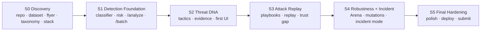

# ATTACK REPLAY — Project Plan (master index)

> **Start here.** This file is the entry point to the entire Attack Replay documentation system.

| | |
|---|---|
| **Hackathon** | National Cybersecurity Innovation Hackathon 2026 (NUST · Ministry of ICT, Postal and Courier Services, Zimbabwe) |
| **Theme** | "Don't Make It Easy for Them: Building a Cyber Strong Zimbabwe" |
| **Challenge** | "Cyber Shield Zimbabwe: Detecting and Responding to Cyber Threats" |
| **Pitch** | *We don't just tell you it's a scam. We let you watch it play out, safely, and show you what you can still undo.* |
| **Philosophy** | **DETECT → EXPLAIN → REPLAY → INTERRUPT → RECOVER** |
| **Last updated** | 2026-09-29 |

## 1. Project overview

Attack Replay is a citizen-facing interpreter for suspicious messages and incident narratives. It classifies a message, explains the tactics used against the user (**Threat DNA**), lets them safely watch the **typical progression** of that kind of attack (**Replay**) with a "still recoverable?" strip, shows how to **verify independently** (**Trust Gap**), helps after harm has happened (**Incident Mode**), and proves robustness against rewritten attacks (**Evasion Arena**). Details: [North Star](docs/00_PROJECT_NORTH_STAR.md).

## 2. Status convention

| Symbol | Meaning |
|---|---|
| 🔵 | PLANNED |
| 🟡 | IN PROGRESS |
| 🟢 | COMPLETE |
| 🔴 | BLOCKED |
| ⚪ | DEFERRED |

Evidence labels used throughout: **KNOWN** (from the proposal/brief) · **PROPOSED** · **TO BE VERIFIED** · **OPEN DECISION**. Nothing is presented as a result unless it was measured; there are **no** dataset statistics, model results or prevalence claims in the planning documents.

## 3. Documentation map

| # | Document | Purpose |
|---|---|---|
| 00 | [Project North Star](docs/00_PROJECT_NORTH_STAR.md) | Identity, thesis, principles, success, is / is-not |
| 01 | [Product Specification](docs/01_PRODUCT_SPECIFICATION.md) | Input, verdict, Threat DNA, replay, trust gap, incident, modes, Arena, batch; priorities |
| 02 | [Hackathon Requirements](docs/02_HACKATHON_REQUIREMENTS.md) | Requirements traceability; competition timeline; TO BE VERIFIED list |
| 03 | [Product Architecture](docs/03_PRODUCT_ARCHITECTURE.md) | Pipeline, components, Mermaid diagram, contract sketch |
| 04 | [Data and ML Strategy](docs/04_DATA_AND_ML_STRATEGY.md) | Dataset discovery, leakage, splits, baseline, normalization, extraction, risk |
| 05 | [Evaluation Strategy](docs/05_EVALUATION_STRATEGY.md) | Metrics, robustness protocol, honesty rules |
| 06 | [UX and User Journeys](docs/06_UX_AND_USER_JOURNEYS.md) | UI sequence, principles, ten journeys |
| 07 | [Attack Replay Playbooks](docs/07_ATTACK_REPLAY_PLAYBOOKS.md) | Playbook architecture and ten proposed scenarios |
| 08 | [Security and Safety](docs/08_SECURITY_AND_SAFETY.md) | Prohibitions, sanitization, privacy, LLM limits |
| 09 | [Demo Strategy](docs/09_DEMO_STRATEGY.md) | Two-minute script, data, fallbacks, judge Q&A |
| 10 | [Submission Plan](docs/10_SUBMISSION_PLAN.md) | Deliverables, inventory, checklist |
| 11 | [Risk Register](docs/11_RISK_REGISTER.md) | 23 risks with mitigation/trigger/owner |
| 12 | [Decision Log](docs/12_DECISION_LOG.md) | Decisions made (DEC-001…017) and open decisions (OD-001…020) |
| 13 | [Backlog](docs/13_BACKLOG.md) | AR-000…AR-041 with priority, dependencies, acceptance criteria |
| — | [Handoff to Development](docs/HANDOFF_TO_DEVELOPMENT.md) | **Read first in a new development chat** |

Sprint documents:

| Sprint | Document | Focus | Status |
|---|---|---|---|
| 0 | [SPRINT_00_DISCOVERY](docs/sprints/SPRINT_00_DISCOVERY.md) | Repo, dataset, requirements, taxonomy, stack | 🔵 PLANNED |
| 1 | [SPRINT_01_DETECTION_FOUNDATION](docs/sprints/SPRINT_01_DETECTION_FOUNDATION.md) | Working analytical backend, `/analyze`, `/batch` | 🔵 PLANNED |
| 2 | [SPRINT_02_THREAT_DNA](docs/sprints/SPRINT_02_THREAT_DNA.md) | Tactics, evidence, grounded explanation, first UI | 🔵 PLANNED |
| 3 | [SPRINT_03_ATTACK_REPLAY](docs/sprints/SPRINT_03_ATTACK_REPLAY.md) | Playbooks, replay, trust gap (central innovation) | 🔵 PLANNED |
| 4 | [SPRINT_04_ROBUSTNESS_AND_INCIDENT_MODE](docs/sprints/SPRINT_04_ROBUSTNESS_AND_INCIDENT_MODE.md) | Incident Mode, Arena, robustness | 🔵 PLANNED |
| 5 | [SPRINT_05_FINAL_HARDENING](docs/sprints/SPRINT_05_FINAL_HARDENING.md) | Integration, polish, deployment, submission | 🔵 PLANNED |

## 4. Source-of-truth hierarchy

1. **Official hackathon requirements** (flyer/brief — not yet verified; see [02](docs/02_HACKATHON_REQUIREMENTS.md))
2. **Existing Attack Replay proposal** (product vision, features, priorities, demo)
3. **Project planning documents** (this documentation set)
4. **Technical decisions in the [Decision Log](docs/12_DECISION_LOG.md)**
5. **Future implementation details**

If an implementation decision conflicts with the proposal, **document the discrepancy in the Decision Log** — do not silently change the product direction.

## 5. Product priorities

| Tier | Features | Backlog priority |
|---|---|---|
| **Must-have** | Classifier, Threat DNA, Replay, Trust Gap, Batch endpoint (plus verdict, risk, explanation, action; submission deliverables) | MUST |
| **Should-have** | Evasion Arena, Incident Mode | SHOULD |
| **Nice-to-have** | Organisation mode, reading-level slider (and optional LLM rephrase) | COULD |
| **Future** | Tarpit, ScamSigma, Herd Immunity ("what's next" slide) | LATER |

## 6. Sprint roadmap

Sprints are work packages, not fixed durations. The proposal's build plan is relative ("Today / Tuesday / Wednesday morning"); the **proposed** mapping is S0+S1 ≈ Today, S2–S4 ≈ Tuesday, S5 ≈ Wednesday morning. Absolute dates are **TO BE VERIFIED** ([OD-005](docs/12_DECISION_LOG.md#open-decisions)).

## 7. Current status

| Area | Status | Notes |
|---|---|---|
| Planning documentation | 🟢 COMPLETE | |
| Sprint 0 — Discovery | 🟡 IN PROGRESS | Dataset inspected ([DATA_CARD](docs/DATA_CARD.md)); taxonomy + stack frozen (DEC-018/019). **Still open:** official flyer/brief (AR-012), hidden-set schema (OD-010), deadlines |
| **Sprint 1 — Detection foundation** | **🟡 IN PROGRESS (core built)** | Normalization+offsets, extraction, calibrated baseline, risk engine, templates, `/analyze`, `/batch`, 46 tests, evaluation harness. See [baseline report](reports/BASELINE_EVALUATION.md). Not yet done: reviewer sign-off (exit criterion), AR-012 |
| Sprint 2 — Threat DNA + UI | 🟡 IN PROGRESS | DNA with exact-word evidence, reading levels, dashboard built on the API (`web/index.html`). No external usability review yet |
| Sprint 3 — Replay / Trust Gap | 🟡 IN PROGRESS | 5 curated playbooks, recoverability strip, Trust Gap with guardrail. Local procedures TO BE VERIFIED |
| Sprint 4 — Incident / Arena | 🟡 IN PROGRESS | Incident Mode + Organisation view on the API. **Arena only in `web/demo.html` prototype** |
| **Guardian (DEC-023)** | **🟡 IN PROGRESS** | IMAP + folder + `/ingest` monitors, notifications, reports, installer. 60 tests; live flow verified on Linux with simulated sources only |
| Dataset discovery, leakage, splits, baseline, normalization, extraction, risk |
| 05 | [Evaluation Strategy](docs/05_EVALUATION_STRATEGY.md) | Metrics, robustness protocol, honesty rules |
| 06 | [UX and User Journeys](docs/06_UX_AND_USER_JOURNEYS.md) | UI sequence, principles, ten journeys |
| 07 | [Attack Replay Playbooks](docs/07_ATTACK_REPLAY_PLAYBOOKS.md) | Playbook architecture and ten proposed scenarios |
| 08 | [Security and Safety](docs/08_SECURITY_AND_SAFETY.md) | Prohibitions, sanitization, privacy, LLM limits |
| 09 | [Demo Strategy](docs/09_DEMO_STRATEGY.md) | Two-minute script, data, fallbacks, judge Q&A |
| 10 | [Submission Plan](docs/10_SUBMISSION_PLAN.md) | Deliverables, inventory, checklist |
| 11 | [Risk Register](docs/11_RISK_REGISTER.md) | 23 risks with mitigation/trigger/owner |
| 12 | [Decision Log](docs/12_DECISION_LOG.md) | Decisions made (DEC-001…017) and open decisions (OD-001…020) |
| 13 | [Backlog](docs/13_BACKLOG.md) | AR-000…AR-041 with priority, dependencies, acceptance criteria |
| — | [Handoff to Development](docs/HANDOFF_TO_DEVELOPMENT.md) | **Read first in a new development chat** |

Sprint documents:

| Sprint | Document | Focus | Status |
|---|---|---|---|
| 0 | [SPRINT_00_DISCOVERY](docs/sprints/SPRINT_00_DISCOVERY.md) | Repo, dataset, requirements, taxonomy, stack | 🔵 PLANNED |
| 1 | [SPRINT_01_DETECTION_FOUNDATION](docs/sprints/SPRINT_01_DETECTION_FOUNDATION.md) | Working analytical backend, `/analyze`, `/batch` | 🔵 PLANNED |
| 2 | [SPRINT_02_THREAT_DNA](docs/sprints/SPRINT_02_THREAT_DNA.md) | Tactics, evidence, grounded explanation, first UI | 🔵 PLANNED |
| 3 | [SPRINT_03_ATTACK_REPLAY](docs/sprints/SPRINT_03_ATTACK_REPLAY.md) | Playbooks, replay, trust gap (central innovation) | 🔵 PLANNED |
| 4 | [SPRINT_04_ROBUSTNESS_AND_INCIDENT_MODE](docs/sprints/SPRINT_04_ROBUSTNESS_AND_INCIDENT_MODE.md) | Incident Mode, Arena, robustness | 🔵 PLANNED |
| 5 | [SPRINT_05_FINAL_HARDENING](docs/sprints/SPRINT_05_FINAL_HARDENING.md) | Integration, polish, deployment, submission | 🔵 PLANNED |

## 4. Source-of-truth hierarchy

1. **Official hackathon requirements** (flyer/brief — not yet verified; see [02](docs/02_HACKATHON_REQUIREMENTS.md))
2. **Existing Attack Replay proposal** (product vision, features, priorities, demo)
3. **Project planning documents** (this documentation set)
4. **Technical decisions in the [Decision Log](docs/12_DECISION_LOG.md)**
5. **Future implementation details**

If an implementation decision conflicts with the proposal, **document the discrepancy in the Decision Log** — do not silently change the product direction.

## 5. Product priorities

| Tier | Features | Backlog priority |
|---|---|---|
| **Must-have** | Classifier, Threat DNA, Replay, Trust Gap, Batch endpoint (plus verdict, risk, explanation, action; submission deliverables) | MUST |
| **Should-have** | Evasion Arena, Incident Mode | SHOULD |
| **Nice-to-have** | Organisation mode, reading-level slider (and optional LLM rephrase) | COULD |
| **Future** | Tarpit, ScamSigma, Herd Immunity ("what's next" slide) | LATER |

## 6. Sprint roadmap

Sprints are work packages, not fixed durations. The proposal's build plan is relative ("Today / Tuesday / Wednesday morning"); the **proposed** mapping is S0+S1 ≈ Today, S2–S4 ≈ Tuesday, S5 ≈ Wednesday morning. Absolute dates are **TO BE VERIFIED** ([OD-005](docs/12_DECISION_LOG.md#open-decisions)).

## 7. Current status

| Area | Status | Notes |
|---|---|---|
| Planning documentation | 🟢 COMPLETE | |
| Sprint 0 — Discovery | 🟡 IN PROGRESS | Dataset inspected ([DATA_CARD](docs/DATA_CARD.md)); taxonomy + stack frozen (DEC-018/019). **Still open:** official flyer/brief (AR-012), hidden-set schema (OD-010), deadlines |
| **Sprint 1 — Detection foundation** | **🟡 IN PROGRESS (core built)** | Normalization+offsets, extraction, calibrated baseline, risk engine, templates, `/analyze`, `/batch`, 46 tests, evaluation harness. See [baseline report](reports/BASELINE_EVALUATION.md). Not yet done: reviewer sign-off (exit criterion), AR-012 |
| Sprint 2 — Threat DNA + UI | 🔵 PLANNED | Prototype exists client-side only (`web/index.html`, demo engine) — not backed by the API |
| Sprint 3 — Replay / Trust Gap | 🔵 PLANNED | Prototype in demo page only |
| Sprint 4 — Incident / Arena | 🔵 PLANNED | Prototype in demo page only |
| Dataset | 🟢 INSPECTED | 12 unique messages; see DEC-019 |
| Official flyer | TO BE VERIFIED | Not yet provided |

## 8. How to use this documentation

| If you want to know… | Read |
|---|---|
| What we are building and why | [North Star](docs/00_PROJECT_NORTH_STAR.md), [Product Spec](docs/01_PRODUCT_SPECIFICATION.md) |
| What the hackathon demands | [Hackathon Requirements](docs/02_HACKATHON_REQUIREMENTS.md) |
| How it should work | [Architecture](docs/03_PRODUCT_ARCHITECTURE.md), [Data & ML](docs/04_DATA_AND_ML_STRATEGY.md) |
| What to build now | [Handoff](docs/HANDOFF_TO_DEVELOPMENT.md) → current sprint document → [Backlog](docs/13_BACKLOG.md) |
| How success is measured | [Evaluation Strategy](docs/05_EVALUATION_STRATEGY.md) |
| How the demo works | [Demo Strategy](docs/09_DEMO_STRATEGY.md) |
| Why something was decided / what's still open | [Decision Log](docs/12_DECISION_LOG.md) |
| What could go wrong | [Risk Register](docs/11_RISK_REGISTER.md) |

Working rules: work from backlog IDs; update the status symbol when work state changes; log decisions **before** diverging; keep docs and code consistent.

## 9. Common Definition of Done

Applies to every backlog item in addition to the sprint-specific DoD:

- [ ] Acceptance criteria in the [Backlog](docs/13_BACKLOG.md) met and checked off
- [ ] Automated tests written and passing; core regression suite green
- [ ] Works with **no LLM and no internet** (unless the item is explicitly optional)
- [ ] Nothing fetches/executes submitted content; output escaping preserved ([Security](docs/08_SECURITY_AND_SAFETY.md))
- [ ] Claims are evidence-grounded; replay/toggle labels intact
- [ ] Decisions and deviations recorded in the Decision Log
- [ ] Affected docs updated; backlog and PROJECT_PLAN statuses updated
- [ ] Any new external model/library/dataset added to the [Submission Plan inventory](docs/10_SUBMISSION_PLAN.md)

## 10. Definition of success

See [North Star §9](docs/00_PROJECT_NORTH_STAR.md). In short: five minimum features on the hidden set via `/batch`; a two-minute demo that shows the attack playing out and what's still undoable; honest evaluation including false positives and held-out mutations; all deliverables submitted; everything works with templates alone; and a new developer can continue from these docs. Numerical targets are an open decision made **after** a baseline exists.
