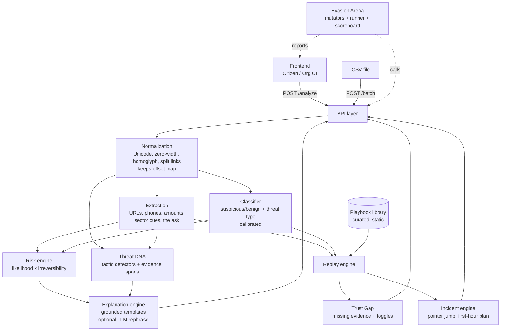

# 03 — Product Architecture

> Documents the architecture described in the proposal. **Technology choices are deliberately not fixed** until the repository and dataset are inspected ([AR-000](./13_BACKLOG.md#ar-000--repository--environment-discovery), [AR-001](./13_BACKLOG.md#ar-001--dataset-inspection)); see [OD-001](./12_DECISION_LOG.md#open-decisions).

**Status:** 🔵 PLANNED

## 1. Conceptual pipeline

```
INPUT → NORMALIZATION → EXTRACTION → CLASSIFICATION → RISK ENGINE → THREAT DNA
      → EXPLANATION → REPLAY ENGINE → ACTION / RECOVERY
```



## 2. Component responsibilities

| Component | Responsibility | Inputs → Outputs | Must not | Backlog |
|---|---|---|---|---|
| **Frontend** | Input form, verdict card, Threat DNA panel, replay UI, trust gap, incident view, Arena scoreboard | User text/toggles → rendered results | Decide verdicts; fetch submitted URLs; depend on internet | AR-020–022 |
| **API** | `/analyze` (UI), `/batch` (CSV), health/error handling; input validation | JSON / CSV → structured result | Execute input; log raw content carelessly | AR-016, AR-017 |
| **Normalization** | Canonicalize text (Unicode, zero-width, homoglyphs, split links, whitespace) while keeping a map back to original offsets | Raw text → normalized text + offset map | Destroy evidence needed for highlighting | AR-014, AR-025 |
| **Extraction** | URLs, phone numbers, amounts, sector/organisation cues, the "ask"; rules + light NER | Normalized text → entities | Resolve/visit URLs | AR-015 |
| **ML classifier** | Benign vs suspicious and threat type; calibrated probabilities | Normalized text (+ features) → label, type, probabilities | Be the sole source of explanations | AR-002, AR-003, AR-019 |
| **Risk engine** | `risk = likelihood × irreversibility of the ask`; Low/Medium/High | Likelihood + ask entities → band + factor breakdown | Output fake-precise numbers as headline | AR-004 |
| **Threat DNA** | Tactic detectors (lexicon + optional embedding similarity), strong/present/absent, evidence spans | Text + entities → tag list | Emit tags without evidence | AR-005 |
| **Explanation engine** | Grounded templates keyed on indicators; offline fallback; optional LLM rephrase at reading level | Indicators + risk factors → reason + action | Let an LLM change verdict/facts | AR-006, AR-028 |
| **Replay engine** | Select playbook by threat type; instantiate stages with message entities; handle user choices; compute recoverability per stage | Type + entities + choice → stage sequence | Generate free-form attack content | AR-007 |
| **Playbook library** | Curated static data per threat type/scenario: stages, typical next messages, recoverability, interruption, recovery | — | Contain real attacker infrastructure or working phishing pages | AR-008 |
| **Trust Gap** | Missing-evidence list, verification checklist, rule-based toggles that shift the risk band | Result + toggles → adjusted band + guidance | Present toggles as learned effects | AR-009 |
| **Incident engine** | Detect harm-already-happened language; jump pointer; first-hour plan; evidence preservation; report drafts | Narrative → stage + plan | Claim to contact providers/police | AR-010 |
| **Evasion Arena** | Mutators; runner calling the detector; scoreboard; patch loop; held-out mutation tests | Seed scams/benign → caught rate, false positives, before/after | Train on held-out mutation types | AR-011, AR-023, AR-024 |
| **Batch endpoint** | CSV in → CSV out (label, type, risk, explanation, action) | CSV → CSV | Require LLM/internet | AR-017 |
| **Data storage** | Model artifacts + metadata; playbook files; Arena run results | — | Persist user messages by default ([Security](./08_SECURITY_AND_SAFETY.md)) | — |

## 3. Data storage (PROPOSED)

- **Default: stateless.** No user database; no persistence of submitted messages.
- **Static, version-controlled assets:** playbooks, lexicons, templates, threat taxonomy (file format OPEN — [OD-001](./12_DECISION_LOG.md#open-decisions)).
- **Artifacts:** trained model file(s) with metadata (data version, seed, training date, metrics) — reproducible.
- **Arena outputs:** result files per run (before/after patch), committed or regenerated (OPEN).

## 4. Proposed API contract sketch (non-binding)

Fields below are **PROPOSED** and derive from the proposal's output list. Exact schema is decided in Sprint 1 and recorded in the [Decision Log](./12_DECISION_LOG.md).

`POST /analyze` — request: `text` (required), `sender?`, `channel?`, `expected?`, `toggles?`, `reading_level?`
Response (conceptual): `label`, `threat_type`, `risk` (band + factors), `reason`, `action`, `dna[]` (tactic, strength, spans), `entities`, `replay` (playbook id, stages, recoverability), `trust_gap`, `incident?`, `meta` (model version, fallback flags, *guidance* labels).

`POST /batch` — CSV in (input columns TO BE VERIFIED) → CSV out: **label, type, risk, explanation, action** (KNOWN).

## 5. Cross-cutting design rules

| Rule | Reason |
|---|---|
| Deterministic core (same input → same output) | Reproducible tests, demo reliability |
| Everything works with templates alone | LLM/internet failure ([DEC-014](./12_DECISION_LOG.md#dec-014)) |
| Offset map through normalization | Evidence highlights must point at the user's original text |
| Every explanation claim links to an indicator or entity | Groundedness ([DEC-003](./12_DECISION_LOG.md#dec-003)) |
| Analysis is text-only; nothing is fetched or executed | [Safety](./08_SECURITY_AND_SAFETY.md) |
| Extras (Arena, Incident, Org mode) sit behind stable interfaces | Must not destabilise core ([DEC-006/007](./12_DECISION_LOG.md#dec-006)) |
| Every result carries flags: `fallback_used`, `llm_used`, model version | Honest reporting |

## 6. Repository layout

**OPEN DECISION** — decided after AR-000 (repository discovery). Only constraint: docs stay under `docs/`, root `PROJECT_PLAN.md` remains the entry point.

## 7. Related

[Data & ML](./04_DATA_AND_ML_STRATEGY.md) · [Playbooks](./07_ATTACK_REPLAY_PLAYBOOKS.md) · [Security](./08_SECURITY_AND_SAFETY.md) · [Backlog](./13_BACKLOG.md)
