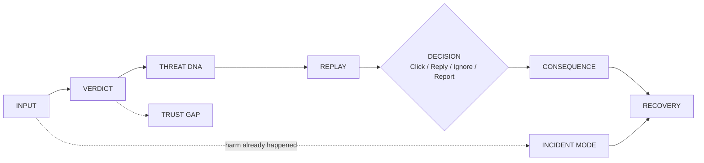

# 06 — UX and User Journeys

**Status:** 🔵 PLANNED · Backlog: AR-020, AR-021, AR-022, AR-009, AR-010, AR-026, AR-027, AR-037

## 1. UI sequence

| Step | Screen content |
|---|---|
| **Input** | Text box, optional sender/channel, "Was I expecting this?" tap, mode |
| **Verdict** | Suspicious/Benign, threat type, risk band, one-line reason, recommended action |
| **Threat DNA** | Message with highlighted tactic tags (strong/present/absent) + extracted entities |
| **Replay** | Staged graph: hook → action point → extraction → takeover/cash-out |
| **Decision** | Click / Reply / Ignore / Report at the action point |
| **Consequence** | Simulated next stage for the chosen action |
| **Recovery** | "Still recoverable?" strip, interruption and recovery steps; Trust Gap checklist |

## 2. UX principles

| Principle | Concretely |
|---|---|
| **Clear** | One idea per card; the verdict and action visible without scrolling |
| **Calm** | No alarmist colours/sounds/language; the goal is understanding, not fear |
| **Trustworthy** | Consistent, sourced from evidence; simulation clearly labelled |
| **Actionable** | Every screen ends in something the user can do |
| **Evidence-based** | Highlights and entities show *why* |
| **No fake certainty** | Bands and words like "likely"/"typical"; never "100% safe" |
| **No fake confidence** | No decimals as headline; toggles labelled "guidance" |
| **No unnecessary jargon** | Plain language by default; technical terms only in Technical/Org level |

Mandatory labels: **"Simulation — educational. Nothing here was sent, opened or paid."** and **"Typical progression for this kind of attack, not a prediction of one specific criminal."** Benign verdicts must never say "safe" without a verification hint.

PROPOSED (not in proposal): mobile-first, low-bandwidth friendly layout; keyboard accessible; colour never the only signal. Language of UI: English first; Shona UI strings OPEN ([OD-011](./12_DECISION_LOG.md#open-decisions)).

## 3. Journeys

### J1 — Suspicious message (MUST)
| Step | User | System |
|---|---|---|
| 1 | Pastes message, taps "Not expected" | — |
| 2 | Reads verdict | Suspicious · type · High/Med · reason names likelihood + irreversibility · action |
| 3 | Opens DNA | Highlighted tactics with strengths; entities (sector, ask, link) |
| 4 | Starts replay | Hook → action point |
| 5 | Chooses Click/Reply/Ignore/Report | Consequence stage + recoverability strip |
| 6 | Reads Trust Gap | Missing evidence + verify-it-yourself checklist |

### J2 — Benign message (MUST)
| Step | User | System |
|---|---|---|
| 1 | Pastes a normal message | — |
| 2 | — | Benign · low risk · reason ("no request for secrets/payment, no suspicious link cues") · optional "how to double-check" |
| 3 | Optionally explores | DNA shows absent/weak tactics; replay not pushed |
Design note: benign is as important as suspicious — it demonstrates false-positive control.

### J3 — User clicks (MUST)
Action point → **Click**: fake page / credential-capture stage (illustrated, never real). Strip: what's undone if you stop here vs after submitting. Interruption: close the page, don't enter details, verify via independent route.

### J4 — User replies (MUST)
Action point → **Reply**: scammer's likely next message + pressure if user hesitates. Shows that replying confirms the number is active (PROPOSED wording — verify claim before use) and how to disengage.

### J5 — User ignores (MUST)
Action point → **Ignore**: the attack stops here; what to do next (delete/block, tell others). Short and reassuring, no fake guarantee.

### J6 — User reports (MUST)
Action point → **Report**: what reporting triggers (channels TO BE VERIFIED); evidence to preserve; pre-drafted report text (with Incident Mode assets if available).

### J7 — User already clicked (SHOULD — Incident Mode)
Narrative "I clicked the link" → pointer jumps to fake-page stage → first-hour plan (don't enter details; if entered, treat as credentials submitted), evidence preservation, report draft.

### J8 — User already sent money (SHOULD — Incident Mode)
Narrative "I already sent the money" → pointer to payment/cash-out stage → **time-critical** plan: contact provider/bank via independently sourced number, keep transaction references, report. Recoverability wording must not promise reversal (window/procedure TO BE VERIFIED).

### J9 — User verifies sender (MUST — Trust Gap)
User follows checklist (open the official service independently, use an independently sourced number), then toggles "sender confirmed through an official channel" → risk band moves with visible *guidance* label and explanation of why; irreversibility warning preserved for OTP/PIN/payment asks (OD-019).

### J10 — Organisation / SOC user (NICE-TO-HAVE)
Switches to Organisation mode → ATT&CK-style tags (Initial Access, Credential Access), indicators to block (URLs, numbers), containment steps, evidence preservation; may use `/batch` for multiple messages.

## 4. Content guidelines

- Reading level target for Normal: plain everyday English; Simple: shorter sentences, no jargon; Technical: precise (slider is NICE-TO-HAVE).
- Every card has one primary next action.
- Do not shame the user; the attack is the problem.
- Error and fallback states are designed screens ("Explanations are running in offline mode"), not blank panels.

## 5. Acceptance-level UX checks (used in Sprint 5)

- [ ] A first-time user completes J1 without instruction.
- [ ] Simulation and "typical progression" labels visible on every replay screen.
- [ ] No decimal confidence is the headline anywhere.
- [ ] All screens usable on a phone-sized viewport (PROPOSED).
- [ ] Works fully with LLM/internet disabled.
