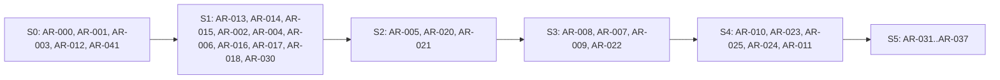

# 13 — Backlog

> Prioritized engineering backlog derived from the proposal. IDs are stable; sprint documents reference them. **All items are 🔵 PLANNED** — this backlog was created in a documentation-only phase.

**Priority scheme:** **MUST** (core; proposal must-haves and submission-critical) · **SHOULD** (proposal should-haves and important quality items) · **COULD** (proposal nice-to-haves) · **LATER** (future/"what's next"). Mapping from proposal tiers: must-have → MUST, should-have → SHOULD, nice-to-have → COULD, future → LATER ([DEC-012](./12_DECISION_LOG.md#dec-012)).
**Status:** 🔵 PLANNED · 🟡 IN PROGRESS · 🟢 COMPLETE · 🔴 BLOCKED · ⚪ DEFERRED

## 1. Index

| ID | Feature / task | Priority | Sprint | Depends on | Status |
|---|---|---|---|---|---|
| [AR-000](#ar-000--repository--environment-discovery) | Repository & environment discovery | MUST | S0 | — | 🔵 PLANNED |
| [AR-001](#ar-001--dataset-inspection) | Dataset inspection | MUST | S0 | AR-000 | 🔵 PLANNED |
| [AR-002](#ar-002--baseline-classifier) | Baseline classifier | MUST | S1 | AR-003, AR-013, AR-014 | 🟡 IN PROGRESS |
| [AR-003](#ar-003--threat-taxonomy) | Threat taxonomy | MUST | S0 | AR-001, AR-012 | 🔵 PLANNED |
| [AR-004](#ar-004--risk-engine) | Risk engine | MUST | S1 | AR-002, AR-003, AR-015 | 🟡 IN PROGRESS |
| [AR-005](#ar-005--threat-dna-detection) | Threat DNA detection | MUST | S2 | AR-001, AR-014, AR-015 | 🔵 PLANNED |
| [AR-006](#ar-006--explanation-engine) | Explanation engine | MUST | S1 | AR-004, AR-015 | 🟡 IN PROGRESS |
| [AR-007](#ar-007--replay-engine) | Replay engine | MUST | S3 | AR-008, AR-015, AR-003 | 🔵 PLANNED |
| [AR-008](#ar-008--playbook-library) | Playbook library | MUST | S3 | AR-003, AR-015 | 🔵 PLANNED |
| [AR-009](#ar-009--trust-gap) | Trust Gap | MUST | S3 | AR-007, AR-004 | 🔵 PLANNED |
| [AR-010](#ar-010--incident-mode) | Incident Mode | SHOULD | S4 | AR-007, AR-008, AR-015 | 🔵 PLANNED |
| [AR-011](#ar-011--evasion-arena) | Evasion Arena | SHOULD | S4 | AR-024, AR-020 | 🔵 PLANNED |
| [AR-012](#ar-012--official-requirements-verification) | Official requirements verification | MUST | S0 | — | 🔵 PLANNED |
| [AR-013](#ar-013--data-loading-validation--splitting) | Data loading, validation & splitting | MUST | S1 | AR-001, AR-041 | 🟡 IN PROGRESS |
| [AR-014](#ar-014--baseline-text-normalization) | Baseline text normalization | MUST | S1 | AR-041 | 🟡 IN PROGRESS |
| [AR-015](#ar-015--entity--ask-extraction) | Entity & ask extraction | MUST | S1 | AR-014 | 🟡 IN PROGRESS |
| [AR-016](#ar-016--analyze-endpoint) | /analyze endpoint | MUST | S1 | AR-002, AR-004, AR-006, AR-015 | 🟡 IN PROGRESS |
| [AR-017](#ar-017--batch-endpoint) | /batch endpoint | MUST | S1 | AR-016 | 🟡 IN PROGRESS |
| [AR-018](#ar-018--test-suite--evaluation-harness) | Test suite & evaluation harness | MUST | S1 | AR-013, AR-016 | 🟡 IN PROGRESS |
| [AR-019](#ar-019--probability-calibration) | Probability calibration | SHOULD | S1 | AR-002 | 🟡 IN PROGRESS |
| [AR-020](#ar-020--frontend-shell) | Frontend shell | MUST | S2 | AR-016 | 🔵 PLANNED |
| [AR-021](#ar-021--threat-dna-ui--evidence-highlighting) | Threat DNA UI & evidence highlighting | MUST | S2 | AR-005, AR-020 | 🔵 PLANNED |
| [AR-022](#ar-022--replay-ui) | Replay UI | MUST | S3 | AR-007, AR-020 | 🔵 PLANNED |
| [AR-023](#ar-023--mutators) | Mutators | SHOULD | S4 | AR-002, AR-014 | 🔵 PLANNED |
| [AR-024](#ar-024--robustness-evaluation--held-out-mutation-tests) | Robustness evaluation & held-out mutation tests | SHOULD | S4 | AR-023, AR-025, AR-018 | 🔵 PLANNED |
| [AR-025](#ar-025--advanced-normalization-hardening) | Advanced normalization hardening | SHOULD | S4 | AR-014, AR-023 | 🔵 PLANNED |
| [AR-026](#ar-026--reading-level-slider) | Reading-level slider | COULD | S5 | AR-006, AR-020 | 🔵 PLANNED |
| [AR-027](#ar-027--organisation-mode) | Organisation mode | COULD | S5 | AR-005, AR-009 | 🔵 PLANNED |
| [AR-028](#ar-028--llm-rephrasing-layer) | LLM rephrasing layer | COULD | S5 | AR-006 | 🔵 PLANNED |
| [AR-029](#ar-029--embedding-enhancements) | Embedding enhancements | COULD | S2 | AR-002 | 🔵 PLANNED |
| [AR-030](#ar-030--security-baseline) | Security baseline | MUST | S1 | AR-016, AR-017 | 🟡 IN PROGRESS |
| [AR-031](#ar-031--error-handling--offline-verification) | Error handling & offline verification | MUST | S5 | AR-016, AR-022 | 🔵 PLANNED |
| [AR-032](#ar-032--deployment) | Deployment | MUST | S5 | AR-016, AR-020 | 🔵 PLANNED |
| [AR-033](#ar-033--technical-summary) | Technical summary | MUST | S5 | AR-018 | 🔵 PLANNED |
| [AR-034](#ar-034--presentation) | Presentation | MUST | S5 | AR-033 | 🔵 PLANNED |
| [AR-035](#ar-035--demo-rehearsal--backup-video) | Demo rehearsal & backup video | MUST | S5 | AR-022, AR-034 | 🔵 PLANNED |
| [AR-036](#ar-036--source-cleanup-attribution--security-review) | Source cleanup, attribution & security review | MUST | S5 | AR-030 | 🔵 PLANNED |
| [AR-037](#ar-037--ux-polish--performance) | UX polish & performance | SHOULD | S5 | AR-022 | 🔵 PLANNED |
| [AR-038](#ar-038--tarpit-future) | Tarpit (future) | LATER | Post | — | 🔵 PLANNED |
| [AR-039](#ar-039--scamsigma-future) | ScamSigma (future) | LATER | Post | — | 🔵 PLANNED |
| [AR-040](#ar-040--herd-immunity-future) | Herd Immunity (future) | LATER | Post | — | 🔵 PLANNED |
| [AR-041](#ar-041--architecture-confirmation--tech-stack-decision) | Architecture confirmation & tech-stack decision | MUST | S0 | AR-000, AR-001 | 🔵 PLANNED |

### Sprint mapping notes

- **AR-003** is drafted and frozen in Sprint 0 (needs the dataset), consumed by Sprint 1.
- **AR-006** and **AR-015** start in Sprint 1 (templates, basic extraction) and are extended in Sprint 2 (grounding in Threat DNA, enriched entities). Primary sprint shown is the first.
- **AR-008** playbook *content* can be drafted earlier in parallel (no code); it is scheduled and accepted in Sprint 3.
- **AR-033** (technical summary) drafting should begin in Sprint 0/1 per the proposal; it is finalized in Sprint 5.
- **AR-029** is a Sprint 2 stretch item (COULD).
- **AR-038–040** (LATER) are post-hackathon; they appear only on the 'what's next' slide (Sprint 5 stretch).

## 2. Dependency overview

## 3. Item details

### AR-000 — Repository & environment discovery

| Priority | Sprint | Depends on | Status |
|---|---|---|---|
| MUST | S0 | — | 🔵 PLANNED |

**Description:** Inspect the existing repository (or confirm none exists), its structure, docs conventions, CI, tooling and the local development environment. Record findings.

**Acceptance criteria:**
- [ ] Repository state documented (exists / does not exist; structure; existing docs)
- [ ] Development environment reproducible on at least one machine; setup steps written down
- [ ] Open questions OD-012 resolved or re-logged
- [ ] No implementation code written

### AR-001 — Dataset inspection

| Priority | Sprint | Depends on | Status |
|---|---|---|---|
| MUST | S0 | AR-000 | 🔵 PLANNED |

**Description:** Load and inspect the released hackathon dataset per the discovery process in Data & ML Strategy: schema, labels, distribution, missing values, duplicates, language mix, leakage scan, fitness for the proposal.

**Acceptance criteria:**
- [ ] Data card written with provenance and licence status (TO BE VERIFIED items closed or logged)
- [ ] Label inventory and class distribution recorded from measurement (not assumed)
- [ ] Duplicate/near-duplicate and leakage findings recorded
- [ ] Availability of sender, channel, risk label, language fields recorded (closes OD-004)
- [ ] Gap list vs proposal produced

### AR-002 — Baseline classifier

| Priority | Sprint | Depends on | Status |
|---|---|---|---|
| MUST | S1 | AR-003, AR-013, AR-014 | 🔵 PLANNED |

**Description:** Char n-gram + word TF-IDF with logistic regression for suspicious/benign and threat type, trained on the frozen taxonomy, evaluated on validation/final test per the Evaluation Strategy.

**Acceptance criteria:**
- [ ] Trained model reproducible from a clean checkout with fixed seed
- [ ] Metrics reported per Evaluation Strategy §3 (precision/recall/F1, confusion matrix, per-class, macro/weighted F1, false-positive rate)
- [ ] Compared against trivial baseline
- [ ] Model artifact saved with metadata (data version, config, metrics)
- [ ] No tuning on final test data

### AR-003 — Threat taxonomy

| Priority | Sprint | Depends on | Status |
|---|---|---|---|
| MUST | S0 | AR-001, AR-012 | 🔵 PLANNED |

**Description:** Map dataset labels to product threat types; freeze the taxonomy; map each type to a playbook (or generic fallback).

**Acceptance criteria:**
- [ ] Taxonomy table recorded with mapping to dataset labels and to brief categories
- [ ] Merges/splits/unmapped labels documented
- [ ] Decision recorded in Decision Log (closes OD-002)
- [ ] Every type has a playbook target or the generic fallback

### AR-004 — Risk engine

| Priority | Sprint | Depends on | Status |
|---|---|---|---|
| MUST | S1 | AR-002, AR-003, AR-015 | 🔵 PLANNED |

**Description:** Implement risk = likelihood × irreversibility of the ask with Low/Medium/High bands; fit weights/thresholds to dataset risk labels if present, otherwise documented rules.

**Acceptance criteria:**
- [ ] Irreversibility weights are transparent, versioned config (OTP/PIN/money/app-install highest; click medium; reply lower)
- [ ] Explanation exposes both factors
- [ ] Rule-consistency tests pass (e.g., credential ask never lower than plain reply at equal likelihood)
- [ ] If risk labels exist: agreement reported; if not: stated as rule-based (no accuracy claim)
- [ ] Thresholds recorded in Decision Log

### AR-005 — Threat DNA detection

| Priority | Sprint | Depends on | Status |
|---|---|---|---|
| MUST | S2 | AR-001, AR-014, AR-015 | 🔵 PLANNED |

**Description:** Tactic detectors (urgency, authority impersonation, fear/loss, reward/lure, secrecy, credential request, payment request, call to action, suspicious links, plus dataset-discovered tactics) returning strong/present/absent with evidence spans.

**Acceptance criteria:**
- [ ] Each detector returns strength + evidence spans mapped to the original text
- [ ] No tag without evidence; no percentages
- [ ] Documented strength rules per tactic
- [ ] Detector tests with positive, negative and mutated examples
- [ ] Dataset-discovered tactics added or explicitly deferred

### AR-006 — Explanation engine

| Priority | Sprint | Depends on | Status |
|---|---|---|---|
| MUST | S1 | AR-004, AR-015 | 🔵 PLANNED |

**Description:** Grounded templates keyed on indicators producing the one-line reason and recommended action; Sprint 1 delivers template baseline, Sprint 2 grounds them in Threat DNA evidence.

**Acceptance criteria:**
- [ ] Reason names both likelihood and irreversibility factors
- [ ] Every taxonomy class has a recommended action template
- [ ] Every claim traceable to an indicator/entity (groundedness check)
- [ ] Works fully offline; no LLM required
- [ ] Sprint 2: explanation references DNA evidence

### AR-007 — Replay engine

| Priority | Sprint | Depends on | Status |
|---|---|---|---|
| MUST | S3 | AR-008, AR-015, AR-003 | 🔵 PLANNED |

**Description:** Select playbook by threat type/entities, instantiate stages with message entities, handle user choices (Click/Reply/Ignore/Report), compute recoverability per stage.

**Acceptance criteria:**
- [ ] Stages hook → action point → extraction → takeover/cash-out generated from message entities
- [ ] Each choice yields the specified consequence
- [ ] Recoverability available for every stage
- [ ] Generic fallback playbook used for unmapped types
- [ ] Output labelled 'typical progression, simulation'

### AR-008 — Playbook library

| Priority | Sprint | Depends on | Status |
|---|---|---|---|
| MUST | S3 | AR-003, AR-015 | 🔵 PLANNED |

**Description:** Author curated playbooks for the proposed scenarios (mobile money, banking, utility, government, university, job, parcel, investment, SIM/account, wrong-number reversal) plus a generic fallback, following the schema in the Playbooks doc.

**Acceptance criteria:**
- [ ] Playbooks pass the QA checklist in the Playbooks doc
- [ ] Local claims flagged TO BE VERIFIED or verified with sources
- [ ] Every taxonomy class mapped
- [ ] Each playbook reviewed by a second person
- [ ] No real brands, numbers or working links

### AR-009 — Trust Gap

| Priority | Sprint | Depends on | Status |
|---|---|---|---|
| MUST | S3 | AR-007, AR-004 | 🔵 PLANNED |

**Description:** Missing-evidence list, verify-it-yourself checklist, and rule-based toggles ('sender confirmed through an official channel', 'I was expecting this') that move the risk band, labelled guidance.

**Acceptance criteria:**
- [ ] Missing-evidence list derived from extracted evidence, not generic filler
- [ ] Checklist includes: don't use the message's link; open the official service independently; use an independently sourced number
- [ ] Toggle rules documented (closes OD-019); labelled 'guidance'
- [ ] Guardrail: OTP/PIN/payment-ask warning preserved after toggles
- [ ] Toggle tests pass

### AR-010 — Incident Mode

| Priority | Sprint | Depends on | Status |
|---|---|---|---|
| SHOULD | S4 | AR-007, AR-008, AR-015 | 🔵 PLANNED |

**Description:** Detect harm-already-happened language (clicked, replied, submitted credentials, transferred money); jump replay pointer; first-hour plan; evidence preservation; pre-drafted report text.

**Acceptance criteria:**
- [ ] Each of the four situations jumps to the correct stage
- [ ] First-hour plan, evidence list and report draft present for each
- [ ] Local reporting channels verified or marked TO BE VERIFIED
- [ ] No claims of contacting providers/police
- [ ] Core flows still pass regression

### AR-011 — Evasion Arena

| Priority | Sprint | Depends on | Status |
|---|---|---|---|
| SHOULD | S4 | AR-024, AR-020 | 🔵 PLANNED |

**Description:** Scoreboard screen and orchestration: run mutated scams through the detector, show caught rate, false positives, apply patch, re-run on held-out mutation types, show DNA stability.

**Acceptance criteria:**
- [ ] Before/after patch and held-out results displayed with false positives
- [ ] DNA stability across rewrites displayed
- [ ] Uses saved results as fallback
- [ ] Does not modify core behaviour
- [ ] Results match the recorded evaluation run

### AR-012 — Official requirements verification

| Priority | Sprint | Depends on | Status |
|---|---|---|---|
| MUST | S0 | — | 🔵 PLANNED |

**Description:** Verify every TO BE VERIFIED item in the Hackathon Requirements against the actual flyer/brief; update traceability and timeline.

**Acceptance criteria:**
- [ ] All TO BE VERIFIED checklist items closed or explicitly re-logged
- [ ] Competition timeline recorded with absolute dates
- [ ] Traceability matrix updated
- [ ] OD-005 and OD-010 resolved or re-logged

### AR-013 — Data loading, validation & splitting

| Priority | Sprint | Depends on | Status |
|---|---|---|---|
| MUST | S1 | AR-001, AR-041 | 🔵 PLANNED |

**Description:** Deterministic loader, schema validation, cleaning, deduplication, group-aware train/validation/test splitting.

**Acceptance criteria:**
- [ ] Schema and label validation fail loudly on unexpected values
- [ ] Cleaning counts logged
- [ ] Splits are group-aware, seeded and reproducible; final test frozen
- [ ] Leakage checks automated where feasible
- [ ] Split strategy recorded in Decision Log

### AR-014 — Baseline text normalization

| Priority | Sprint | Depends on | Status |
|---|---|---|---|
| MUST | S1 | AR-041 | 🔵 PLANNED |

**Description:** Unicode normalization, whitespace/case canonicalization, zero-width stripping and offset map to original text (basic level; hardened in AR-025).

**Acceptance criteria:**
- [ ] Normalization is idempotent (test)
- [ ] Offset map lets any normalized span be highlighted on original text (test)
- [ ] Handles empty, very long and non-Latin inputs without error
- [ ] Zero-width occurrence recorded as a flag

### AR-015 — Entity & ask extraction

| Priority | Sprint | Depends on | Status |
|---|---|---|---|
| MUST | S1 | AR-014 | 🔵 PLANNED |

**Description:** Extract URLs, phone numbers, amounts, sector/organisation cues and the user 'ask' (PIN, OTP, login, money, app install, call-back, click, reply) using rules; enriched in Sprint 2.

**Acceptance criteria:**
- [ ] Extraction never resolves or fetches URLs
- [ ] Ask taxonomy documented and tested
- [ ] Sector cues are context lexicons, not brand lists
- [ ] Precision/recall spot-checked on labelled samples
- [ ] Sprint 2: enrichment for Threat DNA and replay entities

### AR-016 — /analyze endpoint

| Priority | Sprint | Depends on | Status |
|---|---|---|---|
| MUST | S1 | AR-002, AR-004, AR-006, AR-015 | 🔵 PLANNED |

**Description:** API endpoint returning verdict, threat type, risk, reason and action (and later DNA, replay, trust gap, incident) for one message.

**Acceptance criteria:**
- [ ] Returns all five minimum features for valid input
- [ ] Validates and rejects invalid input safely
- [ ] Flags fallback/LLM usage in metadata
- [ ] Deterministic for same input
- [ ] Works offline

### AR-017 — /batch endpoint

| Priority | Sprint | Depends on | Status |
|---|---|---|---|
| MUST | S1 | AR-016 | 🔵 PLANNED |

**Description:** CSV in → CSV out with columns label, type, risk, explanation, action; robust to malformed rows.

**Acceptance criteria:**
- [ ] Row count preserved; required output columns present
- [ ] Malformed rows handled without crashing
- [ ] CSV formula-injection safe
- [ ] Runs without LLM or internet
- [ ] Input schema per OD-010 documented and tested

### AR-018 — Test suite & evaluation harness

| Priority | Sprint | Depends on | Status |
|---|---|---|---|
| MUST | S1 | AR-013, AR-016 | 🔵 PLANNED |

**Description:** Automated tests plus reproducible evaluation script producing the metrics tables and failure-case log.

**Acceptance criteria:**
- [ ] Unit tests for normalization, extraction, risk, explanations, API
- [ ] Evaluation script reproduces reported metrics
- [ ] Regression suite includes demo messages
- [ ] Failure-case log created

### AR-019 — Probability calibration

| Priority | Sprint | Depends on | Status |
|---|---|---|---|
| SHOULD | S1 | AR-002 | 🔵 PLANNED |

**Description:** Calibrate classifier probabilities on held-out data and verify reliability.

**Acceptance criteria:**
- [ ] Calibration method chosen by data size and documented
- [ ] Reliability check recorded
- [ ] Risk engine consumes calibrated probabilities

### AR-020 — Frontend shell

| Priority | Sprint | Depends on | Status |
|---|---|---|---|
| MUST | S2 | AR-016 | 🔵 PLANNED |

**Description:** Input form (message, optional sender/channel, 'Was I expecting this?') and verdict card, wired to /analyze.

**Acceptance criteria:**
- [ ] User can paste a message and see the five minimum features
- [ ] Loading, error and offline states designed
- [ ] No decimal confidence as headline
- [ ] Runs against the local API

### AR-021 — Threat DNA UI & evidence highlighting

| Priority | Sprint | Depends on | Status |
|---|---|---|---|
| MUST | S2 | AR-005, AR-020 | 🔵 PLANNED |

**Description:** Highlighted message text with tactic tags (strong/present/absent) and entity panel.

**Acceptance criteria:**
- [ ] Highlights land on the correct words of the original text
- [ ] Text rendered escaped (no raw HTML)
- [ ] Tags show strength; no percentages
- [ ] Entities (sector, ask, channel/link) displayed with defanged URLs

### AR-022 — Replay UI

| Priority | Sprint | Depends on | Status |
|---|---|---|---|
| MUST | S3 | AR-007, AR-020 | 🔵 PLANNED |

**Description:** Interactive staged replay with the Click/Reply/Ignore/Report decision, consequences and 'still recoverable?' strip; Trust Gap panel.

**Acceptance criteria:**
- [ ] All four choices produce the correct consequence view
- [ ] Recoverability strip visible at each stage
- [ ] Simulation and typical-progression labels visible
- [ ] Usable on a phone-sized viewport (PROPOSED)

### AR-023 — Mutators

| Priority | Sprint | Depends on | Status |
|---|---|---|---|
| SHOULD | S4 | AR-002, AR-014 | 🔵 PLANNED |

**Description:** Generators for homoglyphs, zero-width characters, split links, Shona/English mixing, paraphrase and AI-polished variants with seed lineage.

**Acceptance criteria:**
- [ ] Each mutation class implemented and reproducible
- [ ] Seed lineage tracked
- [ ] Mutation types tagged development vs held-out (OD-009)
- [ ] Benign controls included

### AR-024 — Robustness evaluation & held-out mutation tests

| Priority | Sprint | Depends on | Status |
|---|---|---|---|
| SHOULD | S4 | AR-023, AR-025, AR-018 | 🔵 PLANNED |

**Description:** Run mutations before and after patch; evaluate on held-out mutation types; false positives; DNA stability.

**Acceptance criteria:**
- [ ] Before/after/held-out results recorded honestly with remaining misses
- [ ] False-positive rate on benign and hard-benign reported
- [ ] No tuning on held-out mutation types
- [ ] Results reproducible by script

### AR-025 — Advanced normalization hardening

| Priority | Sprint | Depends on | Status |
|---|---|---|---|
| SHOULD | S4 | AR-014, AR-023 | 🔵 PLANNED |

**Description:** Homoglyph folding, zero-width stripping, split-link re-joining and retraining on development misses (the Arena patch).

**Acceptance criteria:**
- [ ] Improvement measured on development mutations
- [ ] Offset map still valid (highlights unaffected)
- [ ] Core regression suite unchanged or improved
- [ ] Patch recorded in Decision Log

### AR-026 — Reading-level slider

| Priority | Sprint | Depends on | Status |
|---|---|---|---|
| COULD | S5 | AR-006, AR-020 | 🔵 PLANNED |

**Description:** Citizen mode Technical/Normal/Simple reading levels using pre-written template variants (LLM optional).

**Acceptance criteria:**
- [ ] Three levels selectable
- [ ] Facts identical across levels
- [ ] Works offline

### AR-027 — Organisation mode

| Priority | Sprint | Depends on | Status |
|---|---|---|---|
| COULD | S5 | AR-005, AR-009 | 🔵 PLANNED |

**Description:** ATT&CK-style tactic tags, indicators to block, containment steps and evidence preservation for SOC users.

**Acceptance criteria:**
- [ ] Tag mapping documented (OD-016)
- [ ] Indicators exported without fetching anything
- [ ] Does not affect Citizen mode

### AR-028 — LLM rephrasing layer

| Priority | Sprint | Depends on | Status |
|---|---|---|---|
| COULD | S5 | AR-006 | 🔵 PLANNED |

**Description:** Optional rephrasing of grounded templates at the chosen reading level; never decides verdict; falls back to templates.

**Acceptance criteria:**
- [ ] Output validated against source template; mismatch → template
- [ ] Fully disabled by default; rules/privacy checked (OD-006)
- [ ] Tests run with LLM off

### AR-029 — Embedding enhancements

| Priority | Sprint | Depends on | Status |
|---|---|---|---|
| COULD | S2 | AR-002 | 🔵 PLANNED |

**Description:** Optional multilingual sentence embeddings for classifier or tactic similarity, only if baseline weaknesses justify.

**Acceptance criteria:**
- [ ] Justified by measured weakness
- [ ] Runs offline; licence/size recorded
- [ ] Measured gain on validation and held-out mutations

### AR-030 — Security baseline

| Priority | Sprint | Depends on | Status |
|---|---|---|---|
| MUST | S1 | AR-016, AR-017 | 🔵 PLANNED |

**Description:** Input validation, output escaping, no outbound fetch derived from input, secrets hygiene, log policy, CSV injection protection.

**Acceptance criteria:**
- [ ] Security prohibitions S1–S8 have tests or review evidence
- [ ] No message bodies in logs
- [ ] Secrets not in repo

### AR-031 — Error handling & offline verification

| Priority | Sprint | Depends on | Status |
|---|---|---|---|
| MUST | S5 | AR-016, AR-022 | 🔵 PLANNED |

**Description:** End-to-end error handling, graceful degradation and verified operation with LLM and internet disabled.

**Acceptance criteria:**
- [ ] Every failure path shows a designed state
- [ ] Full offline run passes regression suite
- [ ] Malformed batch input tested

### AR-032 — Deployment

| Priority | Sprint | Depends on | Status |
|---|---|---|---|
| MUST | S5 | AR-016, AR-020 | 🔵 PLANNED |

**Description:** Deploy or package the prototype; documented one-command local run; test on a clean machine.

**Acceptance criteria:**
- [ ] Clean-machine setup succeeds using README only
- [ ] Deployment (if any) tested under demo conditions
- [ ] Fallback local run documented (OD-007)

### AR-033 — Technical summary

| Priority | Sprint | Depends on | Status |
|---|---|---|---|
| MUST | S5 | AR-018 | 🔵 PLANNED |

**Description:** Write the short technical summary; drafting begins early, finalized with evaluation results.

**Acceptance criteria:**
- [ ] Contains all planned sections including full external-dependency inventory
- [ ] Numbers taken from a tagged evaluation run
- [ ] Within length limit (TO BE VERIFIED)

### AR-034 — Presentation

| Priority | Sprint | Depends on | Status |
|---|---|---|---|
| MUST | S5 | AR-033 | 🔵 PLANNED |

**Description:** Build the slide deck including the two-minute demo and the 'what's next' slide (Tarpit, ScamSigma, Herd Immunity).

**Acceptance criteria:**
- [ ] Storyline matches Demo Strategy
- [ ] Judge-question answers prepared
- [ ] What's-next slide present, definitions resolved (OD-020)

### AR-035 — Demo rehearsal & backup video

| Priority | Sprint | Depends on | Status |
|---|---|---|---|
| MUST | S5 | AR-022, AR-034 | 🔵 PLANNED |

**Description:** Rehearse the two-minute demo, exercise fallbacks, record and review a backup video.

**Acceptance criteria:**
- [ ] Two full timed rehearsals plus one offline rehearsal
- [ ] Backup video recorded and reviewed
- [ ] Fallbacks B1–B5 prepared

### AR-036 — Source cleanup, attribution & security review

| Priority | Sprint | Depends on | Status |
|---|---|---|---|
| MUST | S5 | AR-030 | 🔵 PLANNED |

**Description:** Clean the repository, complete licence/attribution inventory, run the security review checklist, prepare the final tag.

**Acceptance criteria:**
- [ ] Repository clean, README complete, no secrets
- [ ] Inventory of external models/libraries/datasets/APIs complete
- [ ] Security checklist passes
- [ ] Final tag/archive tested

### AR-037 — UX polish & performance

| Priority | Sprint | Depends on | Status |
|---|---|---|---|
| SHOULD | S5 | AR-022 | 🔵 PLANNED |

**Description:** Copy review, accessibility basics, loading/latency polish, privacy statement.

**Acceptance criteria:**
- [ ] UX acceptance checks in UX doc pass
- [ ] Interaction latency acceptable on demo machine (no numeric target invented)
- [ ] Privacy statement present

### AR-038 — Tarpit (future)

| Priority | Sprint | Depends on | Status |
|---|---|---|---|
| LATER | Post | — | 🔵 PLANNED |

**Description:** Concept named in the proposal for the 'what's next' slide. Not defined in the proposal.

**Acceptance criteria:**
- [ ] Concept described on roadmap slide only (definition TODO, OD-020)

### AR-039 — ScamSigma (future)

| Priority | Sprint | Depends on | Status |
|---|---|---|---|
| LATER | Post | — | 🔵 PLANNED |

**Description:** Concept named in the proposal for the 'what's next' slide. Not defined in the proposal.

**Acceptance criteria:**
- [ ] Concept described on roadmap slide only (definition TODO, OD-020)

### AR-040 — Herd Immunity (future)

| Priority | Sprint | Depends on | Status |
|---|---|---|---|
| LATER | Post | — | 🔵 PLANNED |

**Description:** Concept named in the proposal for the 'what's next' slide. Not defined in the proposal.

**Acceptance criteria:**
- [ ] Concept described on roadmap slide only (definition TODO, OD-020)

### AR-041 — Architecture confirmation & tech-stack decision

| Priority | Sprint | Depends on | Status |
|---|---|---|---|
| MUST | S0 | AR-000, AR-001 | 🔵 PLANNED |

**Description:** Confirm the architecture against findings from AR-000/AR-001 and decide language, frameworks, libraries and file formats (OD-001, OD-014).

**Acceptance criteria:**
- [ ] Stack decision and repository layout recorded in Decision Log
- [ ] Architecture doc updated for any deviation
- [ ] Technical unknowns list produced
- [ ] Offline/deterministic constraints confirmed satisfiable
